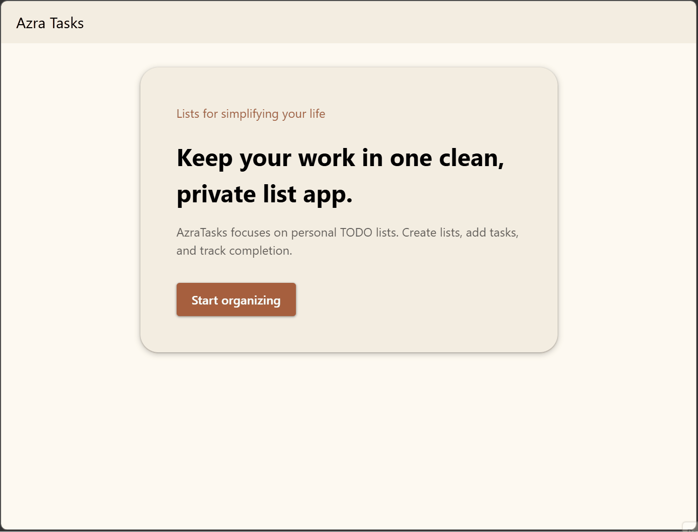
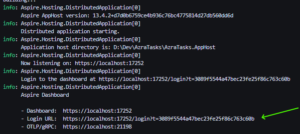
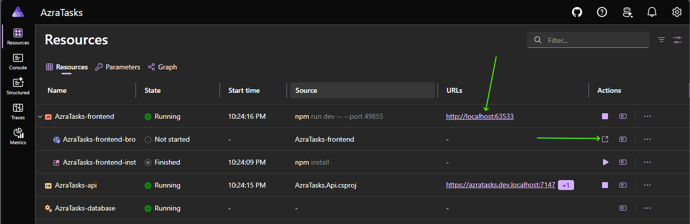
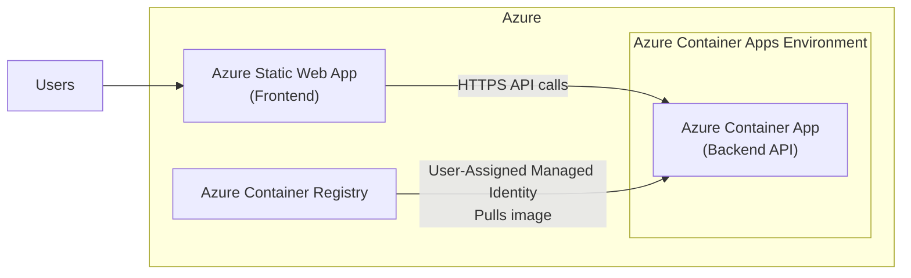

# AzraTaks
A small to-do task management app, built with ASP.NET + Vue.
The structure was heavily influences by my [Aspire React dotnet template](https://github.com/Keboo/DotnetTemplates).

The project is deployed to Azure and the running instance can be found at: https://black-moss-077b5271e.7.azurestaticapps.net/

# Running the project locally
Though the project leverage [Aspire](https://aspire.dev). By launching the app with the Aspire host, it will handle restoring all packages, starting the frontend vite server, starting the backend ASP.NET Core server, and linking everything together.

## Prerequisites

- [.NET SDK v10.0.x](https://get.dot.net)
- [Node v26.x](https://nodejs.org/)

## Launch with the Aspire CLI
If the [Aspire CLI](https://aspire.dev/reference/cli/overview/) is installed, you can simply run `aspire run` from the root of the repository.

## Launch with Visual Studio 2026
- Open the AzraTasks.slnx solution file
- Ensure the AzraTasks.AppHost is set as the startup project
- Press F5 to start the application

## Launch with Visual Studio Code
- Open the repository root in VS Code.
- On the Run and Debug tab ensure the `AzraTasks.AppHost` launch profile is selected and press F5.

## Launch from the terminal
From the root of the repository run `dotnet build` then `dotnet run --project AzraTasks.AppHost/AzraTasks.AppHost.csproj`

### Navigating the Aspire Dashboard
For most of the launch methods above the Aspire dashboard will open in your default browser. For terminal output, you will likely see output similar to the following:

To manually launch the Aspire dashboard, click/copy the Login URL into a browser to launch the Aspire dashboard.

The Aspire Dashboard provides many features, but for simply getting into the running app, click on the link for the frontend resource as shown here:

Alternatively if you would like Aspire to also capture browser logs you can launch a browser with the button indicated above.

# A high-level tour

## Infrastructure
This app is being built and deployed onto Azure infrastructure.

## Backend and Database
The backend components are separated into the Api, Core, Data, and ServiceDefaults projects. Though all of these could be collapsed into a single project, it would mitigate many of the benefits of being able to easily share code with any additional services.
- The Api project is an ASP.NET Core project using [minimal APIs](https://learn.microsoft.com/aspnet/core/fundamentals/minimal-apis). It focuses on the API interactions and auth.
- The Core project contains the business logic of the application. 
- The Data project contains all of the EF Models, DbContext, and related code (such as interceptors) for interacting with the database. 
- The Service Defaults project is the [Aspire generated Service Defaults project](https://aspire.dev/get-started/csharp-service-defaults/).

## Frontend
The frontend application is inside of the AzraTasks.Web project. It is leveraging [Hep API](https://heyapi.dev/) to generate a TypeScript client for the backend using the published OpenAPI spec. 

The authentication is just simple [ASP.NET Core Identity with cookies auth](https://learn.microsoft.com/aspnet/core/security/authentication/identity). There is no validation that the email provided is valid, and it uses the [default password complexity requirements](https://learn.microsoft.com/aspnet/core/security/authentication/identity-configuration?view=aspnetcore-10.0#password).

## Testing
There are two unit test projects for both the Core and Data test projects to ensure that the services and the EF interceptors are working as designed.

# Assumptions + Future Improvements
This is expected to be a "Production MVP". I believe that anything that is production ready needs to be shippable and deployed somewhere. So I included the terraform I used to stand up the Azure infrastructure.

The data of the application is tied to an individual user and there are EF query filters to ensure that lists and items are limited to the authenticated user. I can easily see potential for expansion where the permissions and access would need to be expanded on to support sharing information between users.

SQLite was used as a way to keep things simple, however, it would be the first thing I would replace and move to managed DBMS such as Azure SQL. This simplicity means that each deployment get a fresh database and horizontal scaling is near impossible.

For a real application the authentication would need to be improved as well. Likely abandoning the simple cookie identity auth in favor of real identity providers.

The testing in this solution is reduced to keep the amount of code in this repository smaller and easier to review. For a more complete testing picture, I would be looking to add [frontend test](https://vuejs.org/guide/scaling-up/testing.html), some small number of UI tests (at least to verify accessibility), and [integration tests for the API](https://aspire.dev/testing/overview/).
